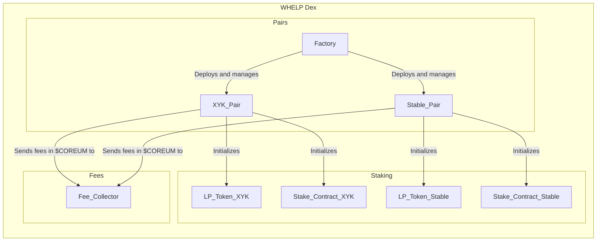
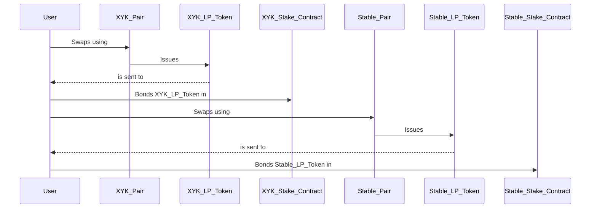
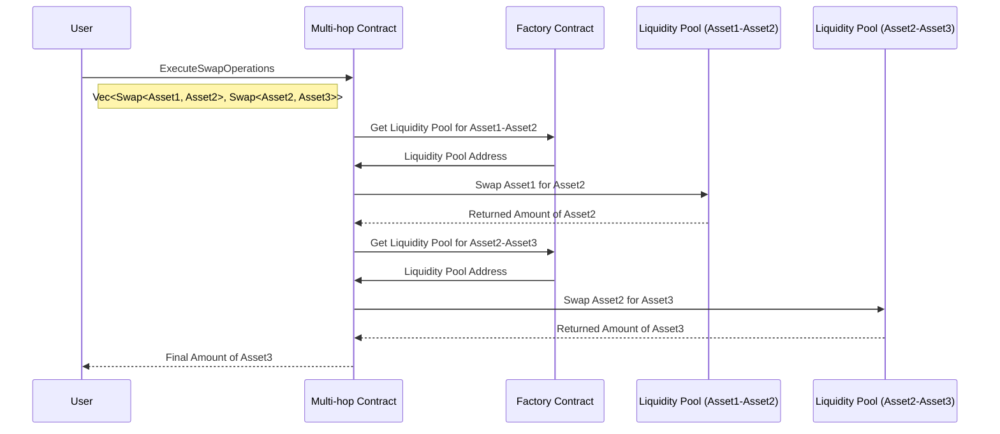

# Architecture

## Initialization

## Usage - swap and bonding

## Swapping between assets using Multi-hop contract

In case there is no direct liquidity pool between the assets, user can use (automatically, through well configured frontend) a Multi-hop contract to specify route of the swaps.

### Main functions

## Factory

1. **Pair Creation**:
   - `CreatePair`: Allows authorized users or contracts to create new liquidity pools (pairs) by specifying the asset pair, pair type (e.g., XYK or Stable), fee configuration, staking parameters, and other relevant settings.

2. **Pair Configuration Management**:
   - `UpdatePairConfig`: Enables authorized parties to modify the configuration of existing liquidity pools. This includes adjusting code IDs, pair types, fee configurations, and enabling or disabling pairs.

3. **Liquidity Pool Deactivation**:
   - `Deregister`: Allows for the deactivation and removal of previously created liquidity pools. Deactivated pools can no longer accept new liquidity or swaps but retain their historical data for reference.

4. **Global Configuration Updates**:
   - `UpdateConfig`: Provides a means to update global contract settings, such as code IDs for relevant contracts (e.g., token contracts), fee addresses for governance fees, permissions for pair creation, and default stake configurations.

5. **Receiver Interface Implementation**:
   - `ReceiveMsg`: Implements the Cw20 receiver interface, enabling the Factory Contract to receive messages related to pair creation and configuration updates from external contracts.

6. **Governance Fee Handling**:
   - `Fee Distribution`: Collects governance fees from liquidity pools and, if specified in pair configurations, directs these fees to the designated fee address (the protocol). Governance fees contribute to the operation and development of the DEX.

7. **Ownership and Permission Control**:
   - `Owner Address`: Specifies the address of the contract owner, who may have certain permissions, such as updating global configurations or creating pairs, depending on the contract's design.

8. **Pair Type Validation**:
   - `PairType Enum`: Defines an enumeration (enum) to categorize pair types, ensuring that pairs are created and configured with appropriate parameters based on their intended use (e.g., XYK or Stable pairs).

9. **Security and Authorization**:
   - `Access Control`: Enforces authorization checks to ensure that only authorized parties can create, configure, or deactivate liquidity pools, update contract configurations, and interact with the Factory Contract.

10. **Stake Contract Integration**:
    - `DefaultStakeConfig`: Provides default values for LP token staking contracts, including staking code ID, token rewards, minimum bond, unbonding periods, and max distributions.

## Pair (liquidity pool)

1. **Liquidity Pool Management**:
   - **ProvideLiquidity**: Allows users to provide liquidity to the pool by depositing assets. It supports multiple assets and considers slippage tolerance to ensure fair pricing.

2. **Asset Swapping**:
   - **Swap**: Facilitates asset swaps within the liquidity pool. Users can specify the asset they want to offer, the desired asset, belief price, maximum spread, and other parameters.

3. **Configuration Updates**:
   - **UpdateConfig**: Enables the modification of the pair's configuration settings, including parameters related to assets, fees, and other options.

4. **Fee Configuration**:
   - **UpdateFees**: Allows updates to the fee configuration for the pair, ensuring that fees align with the DEX's operational requirements.

5. **Contract Ownership**:
   - **ProposeNewOwner**: Provides a mechanism to propose a change in contract ownership. Proposals specify the new owner and an expiration date for validity.
   - **DropOwnershipProposal**: Allows for the removal of an existing ownership change proposal.
   - **ClaimOwnership**: Permits the claiming of contract ownership when a proposal is accepted.

6. **Circuit Breaker**:
   - **Freeze**: Activates a circuit breaker to freeze all functions except for liquidity withdrawal. This can only be invoked if a circuit breaker is set through a MigrateMsg.

7. **Asset Information**:
   - **Asset Infos**: Stores information about the assets in the pool, including their types, codes, and addresses.

8. **Initialization**:
   - **InstantiateMsg**: Defines the initial parameters for the contract, including asset information, token code ID, factory contract address, fees, staking configurations, trading start time, and an optional circuit breaker address.

9. **Receiver Interface**:
   - **ReceiveMsg**: Implements the Cw20 receiver interface to receive and process messages of type `Cw20ReceiveMsg`.

## Staking contract

1. **Token Staking**:
   - **Rebond**: Allows users to update the amount of bonded tokens between different bond periods.
   - **Unbond**: Initiates the unbonding process for a specified number of tokens, with an associated unbonding period.
   - **Claim**: Permits users to claim native tokens previously unbonded after the contract-defined waiting period.

2. **Configuration Management**:
   - **UpdateAdmin**: Provides the ability to change the contract's admin address, allowing admin privileges to be delegated or revoked.
   - **CreateDistributionFlow**: Enables the creation of new distribution flows, specifying the manager, asset, and rewards by unbonding period.

3. **Asset Information**:
   - **Funding**: Supports funding distribution flows with one or more native tokens, updating reward configurations accordingly.
   - **Receive**: Accepts a properly-encoded ReceiveMsg from a CW20 contract.

4. **Reward Distribution**:
   - **DistributeRewards**: Distributes rewards to members proportionally based on their points, allowing for later withdrawal.
   - **WithdrawRewards**: Allows users to withdraw previously assigned rewards, specifying the withdrawal owner and receiver address.

5. **Delegation**:
   - **DelegateWithdrawal**: Authorizes an additional account to perform fund withdrawals on behalf of the owner, ensuring flexibility in fund management.

6. **Querying Data**:
   - **Claims**: Displays tokens in the process of unbonding for a specific address.
   - **Staked**: Provides the number of tokens currently staked by an address for a specific unbonding period.
   - **AllStaked**: Shows the number of tokens staked by an address for all unbonding periods.
   - **TotalStaked**: Reveals the total number of tokens delegated by all users for all unbonding periods.
   - **TotalUnbonding**: Displays the total number of tokens currently being unbonded for all unbonding periods.
   - **TotalRewardsPower**: Shows the total outstanding rewards in the contract.
   - **RewardsPower**: Provides outstanding rewards for a specific address.
   - **Admin**: Returns information about the contract's admin address.
   - **BondingInfo**: Retrieves detailed information about bonding and unbonding activities.
   - **AnnualizedRewards**: Calculates annualized rewards per token for each unbonding period.
   - **WithdrawableRewards**: Reveals the rewards assigned for withdrawal from a specific address.
   - **DistributedRewards**: Shows the total rewards distributed by the contract.
   - **UndistributedRewards**: Displays the total funds sent to the contract awaiting distribution.
   - **Delegated**: Indicates the address allowed for withdrawal of assigned funds.

These functionalities empower the Staking Contract to efficiently manage token staking, rewards distribution, and delegation, while offering extensive querying capabilities to users and administrators.

