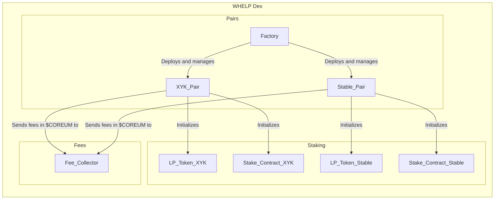
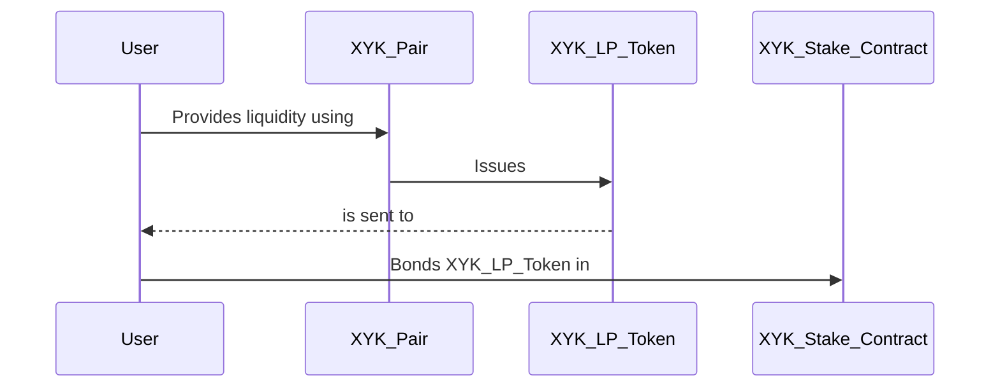
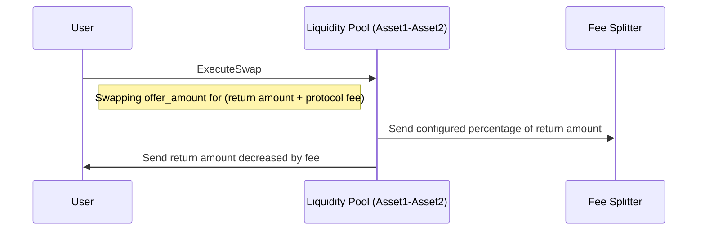
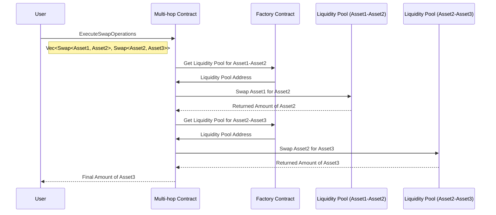

# Architecture

## Initialization

## Usage - providing liquidity and bonding

## Swapping between assets using a pair contract

User can execute swap operations on any liquidity pool.

## Swapping between assets using a Multi-hop contract

In case there is no direct liquidity pool between the assets, user can use (automatically, through well configured frontend) a Multi-hop contract to specify route of the swaps.
Each consecutive swap takes fee percentage, the same way as during regular swap operations.

### Main functions and features

## Factory contract

Factory is a contract responsible mainly for creating new liquidity pools. It automates process of deploying several layers of smart contracts and helps to manage them. It allows to set multiple configurable options, like timestamp when trading will be enabled (disabled by default to avoid early swaps).

1. **Pair Management**:
   - `CreatePair`: Create liquidity pools with asset pairs, fees, and staking parameters.
   - `UpdatePairConfig`: Modify liquidity pool settings.
   - `Deregister`: Deactivate and remove pools while retaining historical data.
   - `DefaultStakeConfig`: Set default values for LP token staking contracts.

2. **Global Configuration**:
   - `UpdateConfig`: Adjust global settings, code IDs, permissions, and default stakes.

3. **Governance Fee Handling**:
   - `Fee Distribution`: Collect and direct governance fees to a designated address.

4. **Ownership and Permissions**:
   - `Owner Address`: Specify contract owner with specific permissions.

## Pair (liquidity pool) contract

Pair contract is a cornerstone of a decentralized exchange. It allows user to provide liqudiity, swap and withdraw liquidity. When user deposits tokens, contract in returns mints LP Share Tokens, which can be staked in Staking Contract for additional rewards.

1. **Liquidity Pool Management**:
   - **ProvideLiquidity**: Deposit assets to provide liquidity with slippage tolerance.
   - **Swap**: Facilitate asset swaps within the pool with user-specified parameters.

2. **Configuration Updates**:
   - **UpdateConfig**: Modify the pair's settings, including assets, fees, and options.
   - **UpdateFees**: Adjust the fee configuration to align with operational requirements.

3. **Contract Ownership** switch mechanism:
   - **ProposeNewOwner**: Propose a change in contract ownership with an expiration date.
   - **DropOwnershipProposal**: Remove an existing ownership change proposal.
   - **ClaimOwnership**: Claim contract ownership when a proposal is accepted.

4. **Circuit Breaker**:
   - **Freeze**: Activate a circuit breaker to freeze functions (except liquidity withdrawal) triggered via MigrateMsg.

5. **Asset Information**:
   - **Asset Infos**: Store details about pool assets, including types, codes, and addresses.

## Staking contract

Staking contract allows to utilize LP Share Tokens by staking them in one of specified unbonding periods.

1. **Token Staking**:
   - **Rebond**: Allows users to update the amount of bonded tokens between different bond periods.
   - **Unbond**: Initiates the unbonding process for a specified number of tokens, with an associated unbonding period.
   - **Claim**: Permits users to claim native tokens previously unbonded after the contract-defined waiting period.

2. **Configuration Management**:
   - **UpdateAdmin**: Provides the ability to change the contract's admin address, allowing admin privileges to be delegated or revoked.
   - **CreateDistributionFlow**: Enables the creation of new distribution flows, specifying the manager, asset, and rewards by unbonding period.

3. **Asset Information**:
   - **Funding**: Supports funding distribution flows with one or more native tokens, updating reward configurations accordingly.
   - **Receive**: Accepts a properly-encoded ReceiveMsg from a CW20 contract.

4. **Reward Distribution**:
   - **DistributeRewards**: Distributes rewards to members proportionally based on their points, allowing for later withdrawal.
   - **WithdrawRewards**: Allows users to withdraw previously assigned rewards, specifying the withdrawal owner and receiver address.

5. **Delegation**:
   - **DelegateWithdrawal**: Authorizes an additional account to perform fund withdrawals on behalf of the owner, ensuring flexibility in fund management.

6. **Querying Data - all neccesary data can be looked up, including**:
   - **Claims**: Displays tokens in the process of unbonding for a specific address.
   - **Staked**: Provides the number of tokens currently staked by an address for a specific unbonding period.
   - **TotalStaked**: Reveals the total number of tokens delegated by all users for all unbonding periods.
   - **TotalUnbonding**: Displays the total number of tokens currently being unbonded for all unbonding periods.
   - **TotalRewardsPower**: Shows the total outstanding rewards in the contract.
   - **RewardsPower**: Provides outstanding rewards for a specific address.
   - **BondingInfo**: Retrieves detailed information about bonding and unbonding activities.
   - **AnnualizedRewards**: Calculates annualized rewards per token for each unbonding period.
   - **DistributedRewards**: Shows the total rewards distributed by the contract.

These functionalities empower the Staking Contract to efficiently manage token staking, rewards distribution, and delegation, while offering extensive querying capabilities to users and administrators.

## Fee splitter contract

Fee splitter is a designed address, that should be configured as default fee collector. During initialization you can specify then what happens with those rewards: how they are split between different addresses.
