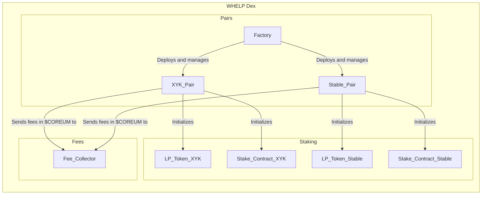
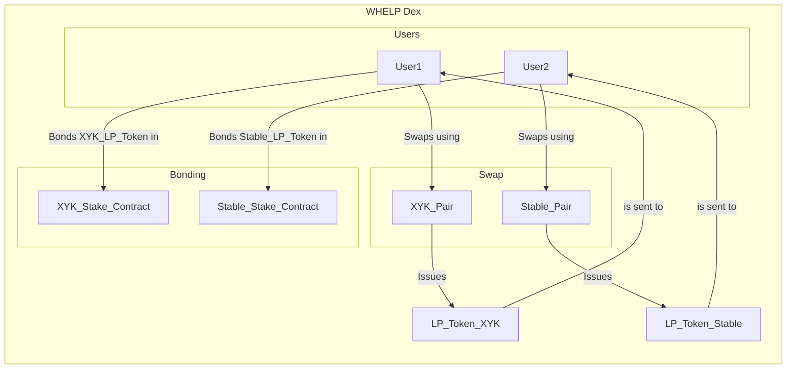

# Architecture

## Initialization

```mermaid
graph LR

subgraph WHELP Dex
    subgraph Pairs
        Factory -->|Deploys and manages| XYK_Pair
        Factory -->|Deploys and manages| Stable_Pair
    end
    subgraph Staking
        XYK_Pair -->|Initializes| LP_Token_XYK
        XYK_Pair -->|Initializes| Stake_Contract_XYK
        Stable_Pair -->|Initializes| LP_Token_Stable
        Stable_Pair -->|Initializes| Stake_Contract_Stable
    end
    subgraph Fees
        XYK_Pair --> |Sends fees in $COREUM to| Fee_Collector
        Stable_Pair --> |Sends fees in $COREUM to| Fee_Collector
    end
end
```

## Usage - swap and bonding

```mermaid
graph LR

subgraph WHELP Dex
subgraph Users
    User1
    User2
end

subgraph Swap
    XYK_Pair
    Stable_Pair
end

subgraph Bonding
    XYK_Stake_Contract
    Stable_Stake_Contract
end

User1 -->|Swaps using| XYK_Pair
User2 -->|Swaps using| Stable_Pair
XYK_Pair -->|Issues| LP_Token_XYK
LP_Token_XYK --> |is sent to| User1
Stable_Pair -->|Issues| LP_Token_Stable
LP_Token_Stable --> |is sent to| User2
User1 -->|Bonds XYK_LP_Token in| XYK_Stake_Contract
User2 -->|Bonds Stable_LP_Token in| Stable_Stake_Contract
end
```
